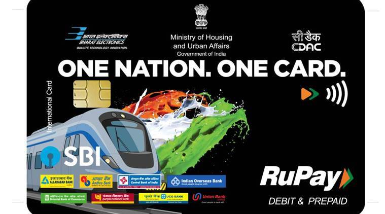

### National Common Mobility Card

National Common Mobility Card (NCMC), is an inter-operable transport cum debit card conceived by the Ministry of Housing and Urban Affairs of the Government of India. It is enabled through the RuPay card mechanism.

> The project involves the development of E-Infrastructure to facilitates NCMC card transactions. The development of electronic terminals for Automated fare collection systems enables public transport operators to accept NCMC card.

### Communication Based Train Control
A CBTC system is an automatic train control system utilizing high-resolution train location determination, independent from track circuits, continuous, high-capacity, bidirectional train-to-wayside data communications. 
> Together trainborne and wayside processors capable of implementing automatic train protection (ATP) functions, automatic train operation (ATO) and automatic train supervision (ATS)

### Mine field Recording system
MFRS enables soldiers to record, lay and later safely retrieve land mines. The system uses Global navigation satellite system (GNSS) in conjuction with Real-time kinematic engine to get maximum positional accuracy. ArcGIS is used to map related solutions.

> accuracy of <10 cm with GNSS using RTK engine

### Hand Held Thermal Imager with Laser Range Finder

HHTI with LRF is a cooled TI based integrated day/night vision device with in-built eye safe Laser Range Finder, Digital Magnetic Compass, Color CCD and GPS.
> This equipment is capable of giving range, azimuth & elevation and also coordinates of the target. This is highly useful to Army and Navy for effective engagement of targets.
and provides detection Range upto 8Km Line of Sight.

